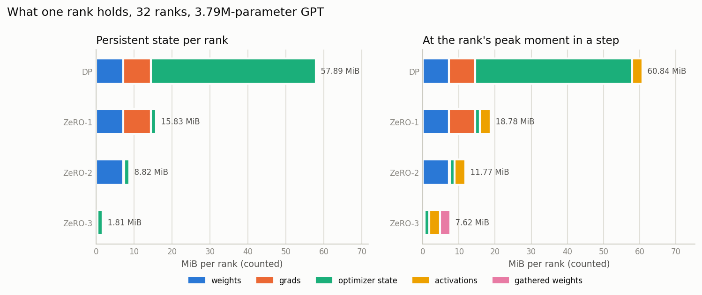
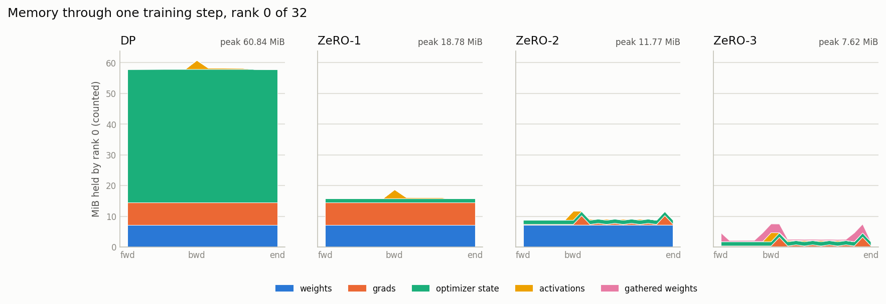
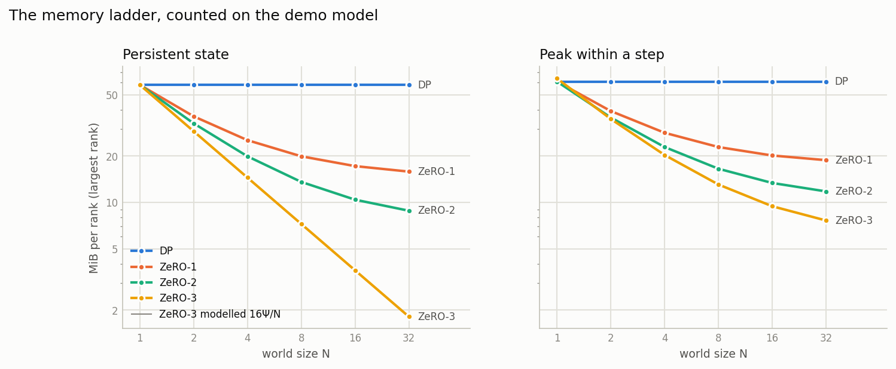
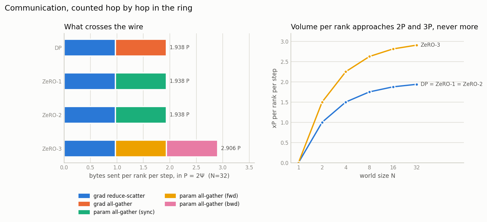
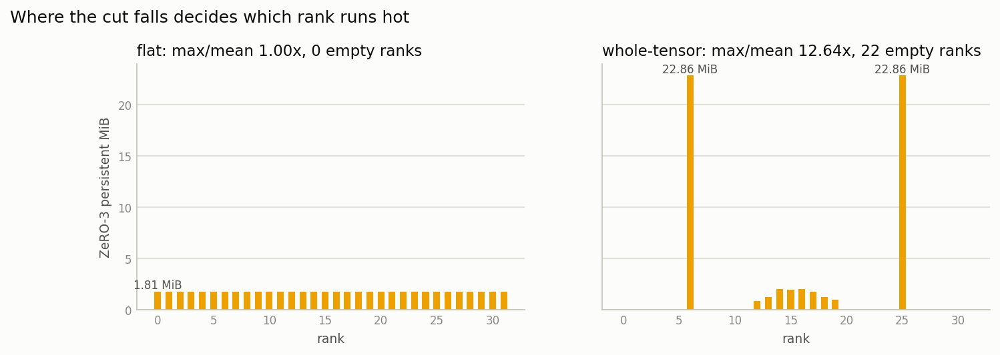
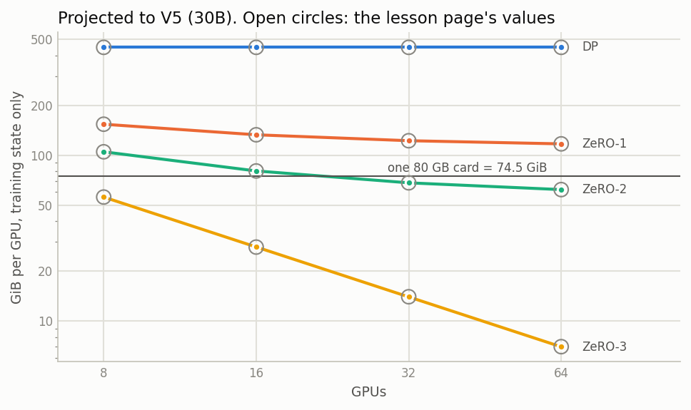
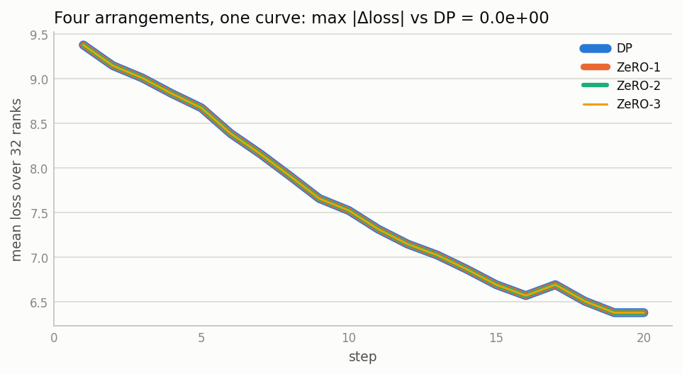

# ZeRO moves bytes, not mathematics — measured on 32 virtual GPUs

**ERA V5 · Session 12 — Distributed Training I: Data Parallel and ZeRO**

> *Work with your agents and create a simple 32 virtual GPUs (can be your CPU threads or Colab GPU).
> Then write a demo model that runs on top of these. Simulate ZeRO1, ZeRO2, and ZeRO3. Show how the
> memory and computation changes.*

📓 **Executed notebook (Colab, Tesla T4):** [`session12_zero_simulator_executed_v1.ipynb`](session12_zero_simulator_executed_v1.ipynb) —
every number below comes from this run · clean copy to re-run: [`session12_zero_simulator.ipynb`](session12_zero_simulator.ipynb) ·
🐍 **Source of truth:** [`notebook_src.py`](notebook_src.py), a percent-format script converted by
[`tools/py2ipynb.py`](tools/py2ipynb.py) ·
📝 **Numbers in this file:** generated by [`tools/make_readme.py`](tools/make_readme.py) from
[`outputs/summary.json`](outputs/summary.json) · 📊 **Figures:** [`outputs/`](outputs/)

📖 **Walkthrough:** [The ZeRO Ledger](https://claude.ai/code/artifact/b614b035-2db2-43b0-8b8f-9fa737115dbc)
— the concepts below, the measured findings, and every cell with the transcript it printed on
Colab. Local copy: [`session12_walkthrough.html`](session12_walkthrough.html), rebuilt by
[`tools/make_walkthrough.py`](tools/make_walkthrough.py)

---

## The idea in one paragraph

Training one weight costs 16 bytes: a 2-byte bf16 copy the matrix multiplications use, a 2-byte bf16
gradient, and 12 bytes of optimizer state (a 4-byte fp32 master copy and Adam's two 4-byte moving
averages). Data parallelism puts all 16 bytes on every GPU and averages gradients between them. That
is exact, but an 8-GPU run stores the same model state eight times. ZeRO keeps the arithmetic and
removes the duplication, in three steps:

- **ZeRO-1** stores each GPU's slice of the optimizer state only.
- **ZeRO-2** also stores only its slice of the gradients.
- **ZeRO-3** also stores only its slice of the weights, and fetches the rest just before each layer runs.

The first two are free on the network, because data parallelism was already doing the same
communication and throwing half of the result away. The third costs half again. This notebook builds
a cluster in which each of those statements is **counted**, and in which "ZeRO does not change the
answer" is a **bit-exact test**.

---

## Part 1 — the concepts, and why each number is what it is

### Why data parallelism needs a collective at all

Every GPU holds the same weights but reads different data, so every GPU computes a different gradient.
If each applied its own, the copies would drift apart after one step. So all of them compute the
**same average** and apply it. They started identical and applied identical updates, so they stay
identical.

The average is not an approximation. The loss is a mean over examples, and the gradient of a mean is
the mean of the gradients. So N GPUs × b sequences each is *mathematically* one GPU with a batch of
N·b. That is the only reason the recipe carries over from one GPU to many.

Why does every GPU compute the average instead of one leader computing it and sending it out? A
leader would make the other GPUs wait twice: once while it computes, once while it broadcasts.
Duplicated arithmetic on hardware that is already paid for costs nothing. Idle GPUs are the expensive
thing.

### The three collectives, and the one equation

| operation | each GPU starts with | each GPU ends with |
|---|---|---|
| **all-reduce** | a full vector | the full averaged vector |
| **reduce-scatter** | a full vector | *its slice* of the averaged vector |
| **all-gather** | its slice | the full vector |

**all-reduce = reduce-scatter + all-gather.** Everything about ZeRO's cost follows from this.

### Where "2P" comes from — the ring

Put the GPUs in a ring and cut the vector into N chunks, one per GPU.

- **Reduce-scatter phase.** Each chunk travels around the ring, and every GPU it passes adds its own
  values. After N−1 hops the chunk is complete, and it stops at its owner.
- **All-gather phase.** Each finished chunk travels the ring again, until every GPU has a copy.

At every hop each GPU sends one chunk of size P/N, where P is the size of the parameters in bytes
(2Ψ for Ψ parameters in bf16). Each phase takes N−1 hops, so each GPU sends **(N−1)/N · P** per phase
and **2(N−1)/N · P** in total. That does not grow with N; it approaches 2P from below. Only one link
per GPU is used, and all links are busy at once.

### ZeRO-1 and ZeRO-2: the same traffic, keeping the slice

After the reduce-scatter phase, each GPU already holds its exact slice of the averaged gradient. Data
parallelism then all-gathers the *gradients* so every GPU can update every weight.

ZeRO-1 and ZeRO-2 stop and **keep the slice**. Each GPU updates only the master weights and Adam state
it owns, then all-gathers the *updated weights* so everyone's working copy is current. That is still
one reduce-scatter (P) and one all-gather (P): **2P, identical to data parallelism**, with most of the
memory returned.

- **ZeRO-1** keeps the full gradient buffer until backward finishes. Per weight: 2 + 2 + 12/N.
- **ZeRO-2** reduce-scatters gradients bucket by bucket as backward produces them, freeing everything
  outside its slice. Per weight: 2 + 14/N.

### ZeRO-3: the weights too, for one extra P

A ZeRO-3 GPU does not hold the weights it needs to compute with. Before each layer runs, the GPUs
**all-gather that layer's weights**, use them, and free them. That happens once in the forward pass
and again in the backward pass, followed by the gradient reduce-scatter. That is **P + P + P = 3P**.
Per weight: 16/N, which keeps halving as N doubles. The price is 1.5× the communication, and a GPU
that owns no complete copy of anything.

### Pros and cons of each arrangement

| | stores per weight | communication | good | bad |
|---|---|---|---|---|
| **Data parallel** | 16 | 2P | simplest; every GPU has a full copy, so any one can checkpoint or take over | memory is flat in N — adding GPUs never lets a bigger model fit |
| **ZeRO-1** | 4 + 12/N | 2P | returns most of the 12-byte optimizer state for free; the update itself shrinks by N | the replicated 4 B/weight is a floor: 4 × Ψ must fit on one card, at any N |
| **ZeRO-2** | 2 + 14/N | 2P | also returns gradients, still free on the wire; bucketed reduce lets communication overlap backward | the 2 B/weight working copy is still replicated; more, smaller collectives to tune; reported to interact badly with some MoE code paths |
| **ZeRO-3** | 16/N | 3P | memory keeps halving with N — the only stage whose ceiling you can buy your way past | 1.5× communication, gathered every layer twice; peak set by the largest layer and activations; no GPU holds a redundant copy to fall back on |

Two things none of the stages touch. **Activations** scale with batch × sequence length and are
identical under all four arrangements. **The arithmetic of the model** is also identical: ZeRO decides
where bytes live, never what a GPU computes on its own data.

### What a "shard" is, and the rank that runs hot

"Give each GPU 1/N of the model" hides a decision about where the cuts go.

- Cut a flattened parameter vector at equal counts, and every rank is within one element of Ψ/N.
  That requires splitting tensors down the middle.
- Refuse to split tensors, and the ranks that own the big tensors — the embedding at the front, the
  output head and softmax at the back — carry far more than the rest. They are the ranks that run out
  of memory first.

Cell 14 measures this.

### Offload, precision, and what this notebook does not simulate

**Offload** moves optimizer state to CPU memory over PCIe (~60 GB/s). It turns a memory problem into
a bandwidth problem, and is out of scope here.

**FP8** shrinks only the 4-byte working set (16 → 14.06 bytes per weight). Its real wins are compute
speed, activation memory and communication volume.

The simulator counts **bytes** exactly. It does **not** claim **seconds**: one Python process
cannot time a cluster, so there is no bandwidth model, no overlap timing, and no H100/B200
comparison. The timings printed are Python-simulator seconds and are labelled that way.

---

## Part 2 — how the 32 virtual GPUs are built

**One process, 32 `Rank` objects.** Each rank holds its own real tensors in a dictionary: bf16
weights, bf16 gradients, fp32 master, Adam m and v, stored in full or as its slice depending on the
stage. Memory is **counted** by walking that dictionary and summing `numel × element_size` — not
computed from a formula. The formula is then checked *against* the count.

**Activations are counted too.** A `saved_tensors_hooks` pack hook records every tensor autograd
saves for backward. It skips storage the rank already holds, so nothing is counted twice.

**Ranks only talk through a ring.** `reduce_scatter` and `all_gather` are implemented hop by hop, and
every hop adds its bytes to the sender's counter. The 2P / 2P / 2P / 3P pattern is therefore an
output of the code, never an input.

**Lockstep over units.** The model is split into units: embed, four blocks, head.

- **Forward.** All 32 ranks run unit *u* and keep only its output.
- **Backward.** All 32 ranks recompute unit *u* with autograd on and back-propagate into it. That is
  activation checkpointing at unit boundaries, applied identically to every arrangement. It is what
  lets 32 simulated ranks reach "unit *u*'s gradients are ready" at the same moment, so a per-unit
  reduce-scatter (ZeRO-2/3) or a per-unit all-gather (ZeRO-3) happens where it would on real hardware.

**Why bit-exact equality is achievable, and therefore demandable.** Within a chunk, the order in
which the ring adds gradients depends only on which rank owns the chunk. It does not depend on
whether the chunk travels inside one big all-reduce (DP), one big reduce-scatter (ZeRO-1) or a
per-unit bucket (ZeRO-2/3). Adam is elementwise, so updating a slice *should* give the same numbers
as updating the whole vector — but the first draft of this notebook showed that elementwise is not
enough (below). Once the optimizer is written so that it really is identical, anything short of
`torch.equal` is a bug — and Cell 10 plants two bugs to prove the gate notices.

**The gate fired on the first draft, and the cause was the optimizer kernel, not ZeRO.** With Adam
written the usual way, `m.mul_(β1).add_(g, alpha=1-β1)`, ZeRO-1's fp32 master weights ended 20 steps
7.5e-9 away from DP's, while losses and bf16 weights still matched. The tolerance was not loosened;
the cause was isolated instead. Cell 8b applies one Adam step to the same state as a whole vector and
shard by shard. On the development machine, the scaled add `add_(g, alpha)` rounded the last bit of
some elements differently depending on where their tensor begins and ends. Whether it does is a
property of the CPU and the kernel path, not of the maths — finding 4b below records what the Colab
CPU did. Writing it as a separate multiply and add removes the disagreement everywhere it was tested. "Identical to data parallelism" turns out to be a promise about the order of
arithmetic *inside the kernels*, not only about which bytes each rank stores.

**The demo model** is the Session 11 GPT, shrunk to 4 layers × 128 wide, with untied embeddings. It
trains on Tiny Shakespeare with GPT-2 BPE, restricted to the token ids the corpus actually uses (an
embedding row that is never looked up still costs 16 bytes). The result is a vector heavy at both
ends, which is what makes the shard-cut experiment meaningful.

**On a GPU runtime** Cell 16 re-runs one step of every arrangement on the card and compares
`torch.cuda.memory_allocated()` against the ledger.

---

## Results









<!-- BEGIN MEASURED -->
*Generated from `outputs/summary.json` by `tools/make_readme.py` — notebook v1, finished 2026-09-14 05:04:50, simulator on `cpu`, GPU check on Tesla T4.*

**Acceptance: 24/24 checks passed.**

### What the run said

**1. Same mathematics, different memory.** On 32 ranks over 20 steps, ZeRO-1, ZeRO-2 and ZeRO-3 finished with fp32 master weights, bf16 working weights and per-step losses **bit-identical** to plain data parallelism (largest difference: 0.0), while one rank's persistent state went from 57.887 MiB to 1.809 MiB — 32× less. The loss fell 3.00 nats, so this is a statement about a model that learned, not about untrained noise.

**2. Data parallelism is one big-batch GPU.** In fp64, the mean of 32 one-sequence gradients matched the gradient of all 32 sequences at once to 2.2e-16 relative — round-off, far below the 1e-12 tolerance. This is the property that lets a recipe move from one GPU to 32 without changing what the model learns.

**3. ZeRO-1 and ZeRO-2 are free on the wire; ZeRO-3 is not.** Counted hop by hop, DP sent 1.9375 P per rank per step, and ZeRO-1 and ZeRO-2 sent **exactly the same bytes, rank for rank, at every world size**. ZeRO-3 sent 2.9062 P = 1.50× DP. The lecture's 2P and 3P are the N→∞ limit of 2(N−1)/N and 3(N−1)/N; at N = 1 every arrangement sent 0 bytes.

**4. At this scale ZeRO-3's peak is not its sharded state.** Rank 0 holds 1.809 MiB between steps but peaks at 7.620 MiB (4.2×) during `step 1: bwd head`. The largest item at that moment is **activations** (2.953 MiB); the sharded 16 bytes are only 24% of it. Activations are identical in all four arrangements (2.953 MiB), and the unit being gathered cannot be smaller than the largest layer.
Across the sweep that gap was **5.811 MiB at every N from 1 to 32**: sharding keeps dividing the 16 bytes, and cannot divide what sits on top of them.

**4b. Bit-exact needs more than elementwise.** On this run's CPU (`AVX512`) the usual fused Adam happened to agree across shard boundaries (0 differing elements; `adam_` 0). On the AVX-512 development machine it did not, and Gate C caught a 7.5e-09 gap in the master weights — so `adam_` is written with separate multiply and add operations everywhere.

**5. The equality gate can fail, and catches what a loss plot hides.** Two planted bugs were both caught. The subtler one, `double_average`, changed the loss by only 1.6e-04 — invisible on a loss curve, because Adam divides a uniform gradient scale back out for most weights — yet moved some individual weights by up to 1.2e-03 against a learning rate of 2e-03.

**6. Where the cut falls decides which rank runs hot.** Cutting the flat vector at equal counts left ZeRO-3 ranks within 1.000× of the mean. Refusing to split a tensor put rank 6 (embed) and rank 25 (head) at 12.6× the mean and left 22 of 32 ranks holding nothing. The embedding and head units are 40% and 40% of the model, so no tensor boundary exists near most of the ideal cuts — the heavy ends of the model become the heavy ranks.

**7. The counted bytes are what a real GPU allocates.** On Tesla T4 (torch.float16), `torch.cuda.memory_allocated()` for the persistent state of all 32 ranks came to 1.0000×–1.0025× the ledger's count across the four arrangements (allocator block rounding). Peak allocation ran 0.86×–1.01× the sum of per-rank ledger peaks. It is reported, not gated, because two effects pull it in opposite directions: the simulator runs ranks one after another, so the card never holds every rank's peak at once and the sum over ranks overstates the simultaneous peak (lowest for ZeRO-1, 0.86×), while kernel scratch and in-flight ring buffers, which the ledger deliberately does not count, push it up (highest for ZeRO-3, 1.01×).

### Memory per rank at N = 32 (counted)

| | bf16 weights | bf16 grads | fp32 master | Adam m | Adam v | **persistent** | bytes/weight counted | modelled | **peak** | peak happens at |
|---|---|---|---|---|---|---|---|---|---|---|
| DP | 7.236 | 7.236 | 14.472 | 14.472 | 14.472 | **57.887** | 16.0000 | 16.0000 | **60.840** | `step 1: bwd head` |
| ZeRO-1 | 7.236 | 7.236 | 0.452 | 0.452 | 0.452 | **15.828** | 4.3750 | 4.3750 | **18.781** | `step 1: bwd head` |
| ZeRO-2 | 7.236 | 0.226 | 0.452 | 0.452 | 0.452 | **8.819** | 2.4375 | 2.4375 | **11.772** | `step 1: bwd head` |
| ZeRO-3 | 0.226 | 0.226 | 0.452 | 0.452 | 0.452 | **1.809** | 0.5000 | 0.5000 | **7.620** | `step 1: bwd head` |

MiB, rank 0. Counted persistent bytes equal the modelled formula *exactly* on every rank (yes).

### The memory ladder and the wire, N = 1 … 32

| N | DP MiB | ZeRO-1 MiB | ZeRO-2 MiB | ZeRO-3 MiB | DP ×P | ZeRO-1 ×P | ZeRO-2 ×P | ZeRO-3 ×P |
|---|---|---|---|---|---|---|---|---|
| 1 | 57.887 | 57.887 | 57.887 | 57.887 | 0.0000 | 0.0000 | 0.0000 | 0.0000 |
| 2 | 57.887 | 36.179 | 32.561 | 28.943 | 1.0000 | 1.0000 | 1.0000 | 1.5000 |
| 4 | 57.887 | 25.325 | 19.899 | 14.472 | 1.5000 | 1.5000 | 1.5000 | 2.2500 |
| 8 | 57.887 | 19.899 | 13.567 | 7.236 | 1.7500 | 1.7500 | 1.7500 | 2.6250 |
| 16 | 57.887 | 17.185 | 10.402 | 3.618 | 1.8750 | 1.8750 | 1.8750 | 2.8125 |
| 32 | 57.887 | 15.828 | 8.819 | 1.809 | 1.9375 | 1.9375 | 1.9375 | 2.9062 |

Persistent MiB on the largest rank; bytes sent per rank per step in units of P = 2Ψ.

### Computation per rank per step, N = 32

| | DP | ZeRO-1 | ZeRO-2 | ZeRO-3 |
|---|---|---|---|---|
| unit forwards | 6 | 6 | 6 | 6 |
| unit recomputes (checkpointing) | 6 | 6 | 6 | 6 |
| unit backwards | 6 | 6 | 6 | 6 |
| Adam elements updated | 3,793,664 | 118,552 | 118,552 | 118,552 |
| reduce-scatter calls | 1 | 1 | 6 | 6 |
| all-gather calls | 1 | 1 | 1 | 12 |
| bytes sent (×P) | 1.9375 | 1.9375 | 1.9375 | 2.9062 |
| *simulator seconds: compute / collectives / Adam* | 2.83 / 0.14 / 1.28 | 2.48 / 0.14 / 0.03 | 2.44 / 0.14 / 0.03 | 2.44 / 0.19 / 0.03 |

Model arithmetic identical across arrangements: **True**. Adam work per rank falls 32× under any ZeRO stage. Simulator seconds are Python in one process — shown for completeness, not as step times.

### Gates

- ✅ A. ring reduce-scatter + all-gather == all-reduce, bit-exact
- ✅ A. reduce-scatter alone leaves each rank its exact slice
- ✅ A. ring bytes == exact expression (even and uneven chunks)
- ✅ B. DP gradient == big-batch gradient (fp64)
- ✅ B'. adam_ on a shard == same slice of full-vector update, bit-exact
- ✅ C. loss fell by at least the declared threshold
- ✅ C. 32 DP replicas bit-identical
- ✅ C. ZeRO-1 bit-identical to DP
- ✅ C. ZeRO-2 bit-identical to DP
- ✅ C. ZeRO-3 bit-identical to DP
- ✅ C'. planted bug 'drop_contribution' caught
- ✅ C'. planted bug 'double_average' caught
- ✅ D. counted persistent == modelled, every rank (N=32)
- ✅ D. no leak across steps, no transient survives a step
- ✅ D. activation bytes identical across arrangements
- ✅ E. ring bytes == exact expression, every rank, every N
- ✅ E. ledger == modelled, every rank, every N
- ✅ E. ZeRO-1 and ZeRO-2 send exactly DP's bytes
- ✅ E. ZeRO-3 sends exactly 1.5x DP (even shards)
- ✅ 13. model arithmetic identical across arrangements
- ✅ 14. whole-tensor partition more imbalanced than flat
- ✅ F. 30B projection matches the lesson page (16 cells)
- ✅ F. ZeRO-1 floor exceeds the card; 20B boundary
- ✅ 16. GPU-measured persistent within 1% of counted

### Projected to V5: 30B parameters (GiB per GPU, training state only)

| | N=8 | N=16 | N=32 | N=64 |
|---|---|---|---|---|
| DP | 447.0 (447.0) | 447.0 (447.0) | 447.0 (447.0) | 447.0 (447.0) |
| ZeRO-1 | 153.7 (153.7) | 132.7 (132.7) | 122.2 (122.2) | 117.0 (117.0) |
| ZeRO-2 | 104.8 (104.8) | 80.3 (80.3) | **68.1** (68.1) | **62.0** (62.0) |
| ZeRO-3 | **55.9** (55.9) | **27.9** (27.9) | **14.0** (14.0) | **7.0** (7.0) |

Bold = under one 80 GB card (74.5 GiB); brackets = the lesson page. ZeRO-1's replicated 4 bytes/weight is 111.8 GiB at 30B on every card at any N, and fills a card at 20.0B parameters. Smallest world that fits: DP none (at ≤64), ZeRO-1 none (at ≤64), ZeRO-2 32, ZeRO-3 8. Activations come on top, and finding 4 above is the reminder of how much they can be.
<!-- END MEASURED -->

---

## Limits, stated plainly

- **No step times.** Bytes are exact; seconds are not modelled. Converting bytes to seconds needs a
  bandwidth model (NVLink 450 GB/s, InfiniBand 50 GB/s) and a statement of how much transfer overlaps
  compute. Neither is measured here.
- **In-flight ring buffers are not in the ledger.** A real library sends through a fixed
  communication buffer. The GPU check's peak ratio is where that shows up.
- **Activation checkpointing is on for every arrangement.** Activations are therefore
  boundary-plus-one-unit, not the full graph. That is the same under all four stages, so every
  comparison stands, but the absolute activation numbers are for a checkpointed model.
- **No gradient clipping.** A global norm is itself a collective and would make the equality test
  about more than ZeRO.
- **Flat shards are unpadded** (sizes differ by at most one element). DeepSpeed pads to equal sizes.
- **The T4 check uses fp16** because a T4 has no native bf16. The bytes per element are the same.

## Files

```
notebook_src.py                  source of truth (percent format)
session12_zero_simulator.ipynb   generated by tools/py2ipynb.py - the file to open in Colab
session12_zero_simulator_executed_v1.ipynb   the Colab T4 run the measured section comes from
tools/py2ipynb.py                .py -> .ipynb
tools/make_readme.py             outputs/summary.json -> the measured section above
tools/make_walkthrough.py        README.md + executed notebook -> session12_walkthrough.html
tools/walkthrough.css            the Session 10/11 walkthrough design system
session12_walkthrough.html       local copy of the published walkthrough
outputs/summary.json             every number the write-up uses
outputs/RESULTS.md               the same tables, written by the notebook's last cell
outputs/f1..f7_*.png             figures
```
